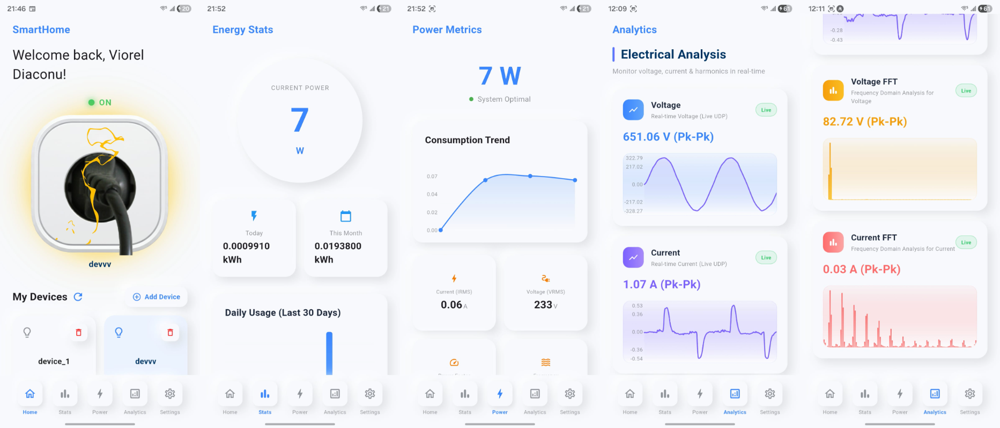

# Smart_outlet_with_mobile_app

## This project is split into two parts: the firmware for ESP32-S3 and the mobile app. The firmware was written in ESP-IDF and the mobile app was built with Flutter. The firmware measures the signals from two sensors — SCT013-010 for current and ZMPT101B for voltage — and calculates Vrms, Irms, active/apparent/reactive power, energy consumption, grid frequency, and THD for both current and voltage. It also sends the measured values to a cloud platform (Supabase) for storage. In the mobile app, the user needs to create an account and sign in in order to add their device. From the app, the user can remotely control the relay module, view electrical parameters in real-time, and also see the waveform and FFT of current and voltage in real-time if the ESP32-S3 and the phone are connected to the same Wi-Fi network.

